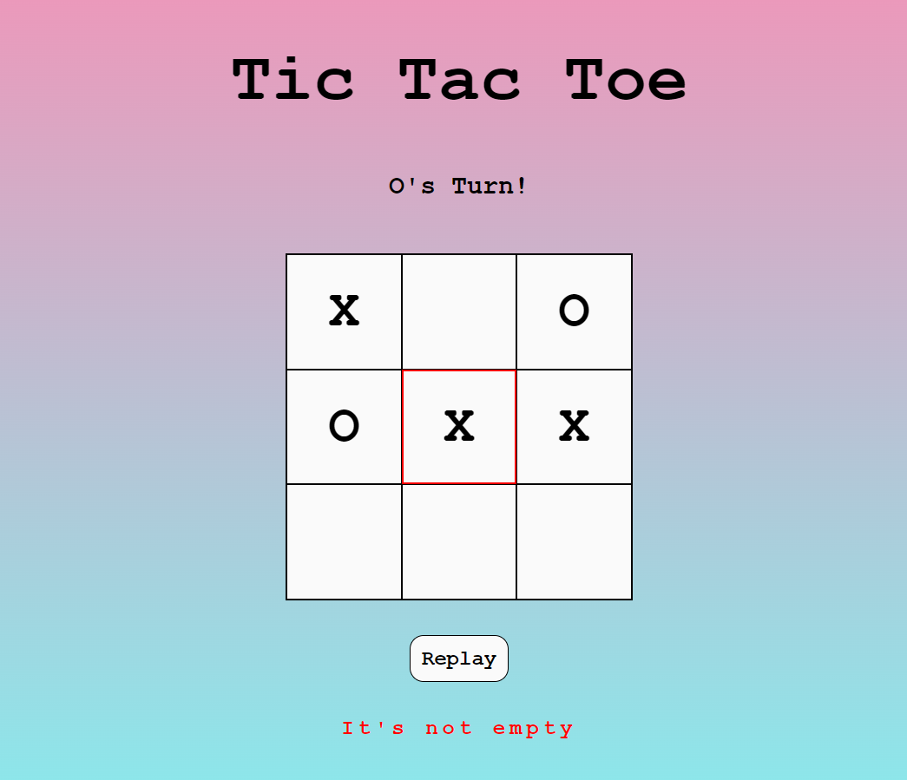
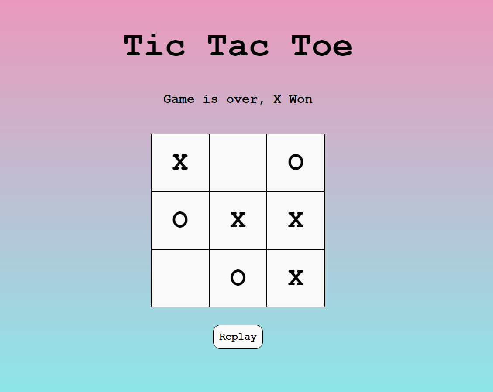

# hafta1-odev2-assignment-cigdemkocak-1
hafta1-odev2-assignment-cigdemkocak-1 created by GitHub Classroom

 ## Tic-Tac- Toe
 
 Satırda, sütunda ya da çapraz olarak 3 X ya da 3 O olmasını sağlayan oyuncu oyunu kazanır.

